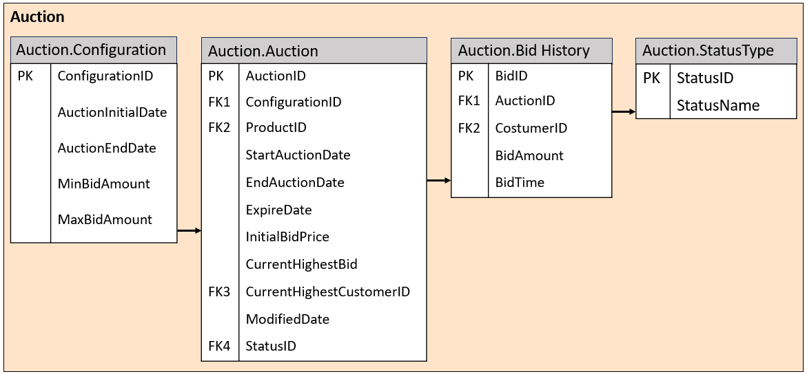
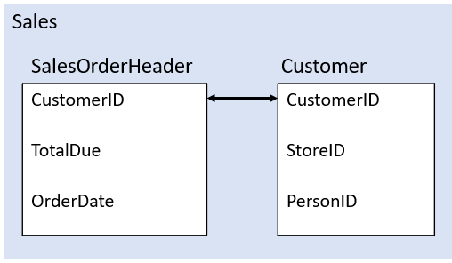
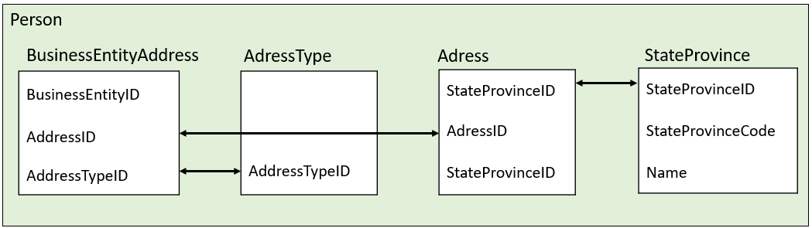

# RANRD Group_AA_TP1 - ADVENTURE WORKS AUCTION 

---

## Project Overview
### Adventure Works Database
The AdventureWorks database contains a rich relational schema covering sales, production, purchasing, human resources (“HR”), and person data across multiple schemas. Key schemas relevant to this project include Sales (customers, orders, stores), Production (products, work orders, inventory), and Person (addresses, business entities). 
Products are classified by MakeFlag (whether manufactured in-house) and are associated with a ListPrice, a SellEndDate, and a DiscontinuedDate. 
These elements provide the foundation for the analyses performed in this report.

#### Business Case 1 - Stock Clearance
Each year, when new bicycle models are announced in December, Adventure Works is left with a large amount of inventory from older models. An aggressive discount campaign implemented in the previous year failed to resolve this issue. To address the problem more effectively, leadership approved an online auction campaign for selected products whose replacements models are expected to be announced soon. This project’s main goal is to make sure the auction is not only possible but also accounts for these functional specifications:
- Only products that are currently commercialized and have stock;
The initial bid price is either 75% or 50% of listed price depending on if they are manufactured in-house or not, respectively;
- The minimum bid increase is 5 cents and maximum bid equivalent to initial product listed price.
In addition, this auction will be held during the last two weeks of November, including Black Friday, when website traffic is expected to be especially high meaning that special measures should be taken as we address the overload of work the system will have during this period. This means using the correct methods of error handling and transactions as necessary. 
#### Business Case 2 - Brick-and-Mortar Stores
Adventure Works currently sells exclusively through retail store partners and its online channel. The company now intends to open two new physical stores in the United States. To avoid direct competition with its own reseller store partners, cities where the top 30 highest-revenue US reseller stores are located must be excluded from consideration. Individual (non-store) customer purchasing data is used to identify the best candidate cities.

---

## Group Information

**Group Name:** Group_AA_TP1

| Student Name | Student ID |
| :--- | :--- |
| **Student 1** | 20250977 (João Carvalho) |
| **Student 2** | 20250984 (Beatriz Farreca) |
| **Student 3** | 20250986 (Ricardo Barracho) |
| **Student 4** | 20250983 (Tomás Valverde) |

---

## Auction System Design and Implementation
With the main objective of this project being the creation of a T-SQL file to extend the AdventureWorks database schema, several key setup steps were taken to ensure everything ran smoothly.

### Schema Design
The first step taken was the design and creation of the necessary tables including pre-populating any necessary values. All new objects were created within the dedicated Auction schema to isolate auction functionality from the existing AdventureWorks database schema. The schema comprises four tables:

#### Auction.Configuration Table
The Auction.Configuration table was used to hold the auction configurations necessary, such as:
- ConfigurationID – This is the primary key of this table. Since this is the first entry, it will be number one. If any other auction is held in the future, a new row must be added for that auction with the corresponding number;
- AuctionInitialDate – The start date of the auction;
- AuctionEndDate – The end date of the auction;
- MinBidAmount – The minimum amount allowed for that specific auction. In this case, the value of 5 cents was defined.
This table is one of the tables that must be pre-populated. In this case, only one record/line per Auction held is necessary. The values input were:
- ConfigurationID – 1;
- AuctionInitialDate – 2025-11-16;
- AuctionEndDate – 2025-11-30;
- MinBidAmount – 0.05;
- MaxBidAmount – 100.00.

#### Auction.Auction Table
The Auction.Auction table was used to hold the information for one specific product that was set to be in auction at some point in time:
- AuctionID – This is the primary key of this table. This is an automated field that inputs a unique ID for each auction of a ProductID;
- ConfigurationID – This is a foreign key. It is used to connect to the current Auction configuration number;  
- ProductID – This is a foreign key. It has the ID of the product that we want to auction;
- StartAuctionDate - The start date of the auction for that specific product;
- EndAuctionDate – The end date of the auction for that specific product;
- ExpireDate - The auction expiration date of that specific product. This is either one week after the product is added to auction or the end of the entire auction, whoever comes first;
- InitialBidPrice – The initial bid price is set automatically, and it is either 75% or 50% of listed price depending on if they are manufactured in-house or not, respectively;
- CurrentHighestCustomerID – This is a foreign key. It sets automatically the ID of a Customer that holds the current highest bid when the bid is entered with the respectively stored procedure;
- ModifiedDate – The modified date is set automatically whenever a change is made to that product with a stored procedure;
- StatusID – This is a foreign key. It has an integer value, and it is used to connect to the table Auction.StatusType in order to pick up the status name.
This table does not need to be pre-populated. Instead, it is populated through a stored procedure.

#### Auction.BidHistory Table
The Auction.BidHistory table was used to hold the information for every bid made during the auction:
- BidID - This is the primary key of this table. This is an auto-generated field that assigns a unique ID to each bid placed;
- AuctionID - This is a foreign key. It is used to connect a bid to the auction of a product;
- CustomerID - This is a foreign key. It is a mandatory input parameter in the stored procedure, used to store the ID of the customer who placed the bid;
- BidAmount – This field is used to store the bid made by a certain costumer;
- BidTime – The time stamp of the time that a bid was made.
- This table does not require pre-population. The population is made via a stored procedure.

#### Auction.StatusType Table
The Auction.StatusType is a pre-populated table that is only used for storage of status name. It consists of only 2 fields:
- StatusID – Primary key. It holds a unique value for each line generated automatically;
- StatusName – The name of each status.
The Auction.StatusType table is pre-populated with five states: Active, Hold, Cancelled, Expired, and Sold. The “Hold” status supports products added before the auction's official start date. These are automatically converted to “Active” once the auction start date is reached. Figure 1 shows the tables created for the Auction schema. 

*Figure 1 - Auction Schema*

### Idempotent Script Design
The Auction.sql script is fully idempotent. Schema and table creation blocks were used, IF NOT EXISTS guards, ensuring that re-execution on a live database does not result in errors or duplicate data. Any population of the tables are added only during table creation, never on subsequent runs. 
All stored procedures use CREATE OR ALTER, meaning they are safely updated on each execution, ensuring the idempotent feature of the SQL script

### Stored Procedures
#### uspAddProductToAuction
This procedure validates the following business rules before inserting into Auction.Auction:
- The product must exist, must not have a SellEndDate or DiscontinuedDate set, and must have positive stock in Production.WorkOrder;
- No concurrent active or on-hold auction may exist for the same product;
- The StartAuctionDate is set to the configured auction start date or GETDATE(), whichever is later;
- Status is set to “Hold” if the auction has not yet started, set to “Active” otherwise;
- If no “ExpireDate” is supplied, it defaults to one week from current date, capped at the global AuctionEndDate;
- If no InitialBidPrice is supplied, it is calculated as 75% of ListPrice for externally sourced products (MakeFlag = 0) and 50% for all others.

#### uspTryBidProduct
This procedure places a bid on behalf of a customer. It enforces these rules:
- The product must have an “Active” auction that has not yet expired;
- The bid must be equal or higher than the current highest bid (or InitialBidPrice if no bids exist), plus the configured minimum increment;
- The bid cannot exceed the product's ListPrice;
- A transaction with UPDLOCK on the StatusType join prevents race conditions under high concurrency, which is critical given the expected Black Friday traffic spike.
If no BidAmount is provided, the procedure automatically places a bid to the current price plus the minimum increment defined at a value of 5 cents, facilitating a quick sequential bidding process.

#### uspRemoveProductFromAuction
Sets the auction status to “Cancelled” and records the EndAuctionDate. The record is kept in the BidHistory table so that customers can still view the cancelled status in their bid history, ensuring the audit trail requirement is met.

#### uspListBidsOffersHistory
Returns a customer's bid history filtered by date range. The @Active bit parameter controls whether to return only currently active/hold auctions (the default) or all historical bids including cancelled, expired, and sold items, giving customers full transparency over their activity.

#### uspUpdateProductAuctionStatus
This procedure performs a status sweep, and it is intended to be called on a scheduled basis (e.g., before each dispatch processing run). It handles four transitions:
- Hold to Active: when StartAuctionDate has passed and the auction has not yet expired;
- Active to Hold: if the auction start date is in the future (e.g., after a configuration rollback);
- Active to Sold (max price reached): when CurrentHighestBid >= (ListPrice – 0.05);
- Active to Sold or Expired at expiry: products with at least one bid become “Sold”; products with no bids become “Expired”.

### Black Friday Peak - Error Handling and Transactions
All stored procedures implement TRY/CATCH blocks for error handling. Custom error codes (50001–50005) are used to provide clear diagnostics for application error-handling. 
The uspTryBidProduct procedure executes within an explicit transaction using UPDLOCK to serialize concurrent bids on the same product, preventing multiple customers from simultaneously winning the same auction. 
This design is especially important during high-traffic periods such as Black Friday.

---

## Brick-and-Mortar Store Recommendation
### Methodology
In order to achieve the main goal of this business case - identifying the two best cities for opening the first brick-and-mortar stores - a few key points were considered. The first step was to define the expected output, which in this case, is a single table listing the two recommended cities. Knowing what we wanted to achieve was key to guide the subsequent steps. The approach was:
- Identify the top 30 US reseller stores by total sales during 2023-2025 period;
- Extract the cities of these top 30 stores to form an exclusion list;
- Aggregate purchases made by individual (non-store) customers by city for the same period, excluding cities in the exclusion list;
- Rank the remaining candidate cities by total individual customer spending and select the top two.

### Query Design
The thought process behind designing the necessary queries to achieve the required output is essential to ensure that all components are properly connected and that no redundant operations are performed.  
Two temporary tables (#Sales and #Location) were created at the start of the script to avoid repeated joins across large tables. Each table was created with the help of a Common Table Expression (CTE).  
The #Sales table captures all orders from 2023 onwards. It explores the connection between the tables Sales.SalesOrderHeader and Sales.Customer on CustomerID, represented in Figure 2.

*Figure 2 - Connections used for the creation of #Sales*

The #Location table captures US based addresses with their state and city. This query explores the connection between four tables, Person.BusinessEntityAddress with Person.Address on AddressID, Person.Address with Person.AddressType on AddressTypeID and Person.AddressType with Person.StateProvince on StateProvinceID.

*Figure 3 - Connections used for the creation of #Location*

The Top_30 CTE computes total revenue per store for the three-year window and selects the 30 highest-revenue stores. It connects the temporary tables #Sales and #Location on StoreID with BusinessEntityID where StoreID is not null. Additionally, AddressTypeID is considered as Main office only.  
The final query then takes advantage of the connection between BusinessEntityID and PersonID (where StoreID is null) and aggregates individual customer revenue by city, excluding cities in the Top_30 CTE, and returns the two highest-revenue cities.

### Results and Recommendation
Based on the query results from the AdventureWorks dataset, the two recommended cities for Adventure Works' first brick-and-mortar stores are presented in Table 1. 
These cities show the highest aggregated individual customer purchasing volume in the US among all locations not already served by a top-30 reseller store.
The exclusion of the top-30 reseller cities ensures that AdventureWorks does not compete directly with its own reseller network. 
At the same time, selecting cities based on individual customer spending makes it more likely that the new stores will capture strong retail demand from customers already familiar with the brand through online purchases. 
Together, the two chosen cities represent new retail opportunities supported by clear demand signals.

*Table 1 - Cities recommendation*

| Rank | City |
| :--- | :--- |
| 1st | Bellflower |
| 2nd | Burbank |

---

## Design Decisions
Separating auction data into a dedicated schema (Auction) rather than embedding it within the existing Sales or Production schemas, provides clear namespace isolation, simplifies permission management, and allows the extension to be easily removed or managed independently through version control. 
The use of a Configuration table rather than constants directly in stored procedure logic was a deliberate design choice to satisfy the configurability requirement without requiring schema changes for routine parameter updates.
The choice to use UPDLOCK in uspTryBidProduct was to apply update locks during operations, ensuring that rows read for a future update are not modified by other transactions in the meantime. Row level locking on the status join prevents phantom bids while keeping the lock scope narrow to minimise contention across concurrent auctions for different products.
The fully idempotent script design is a production-grade practice: it enables the script to be safely re-run after partial failures during deployments. The use of CREATE OR ALTER for stored procedures, combined with IF NOT EXISTS guards for tables and schema, ensures repeatable deployments without manual inspection.

---

## Conclusion
This project demonstrates the extension of a production grade relational database to support two distinct business requirements: an online auction platform for stock clearance and a data-driven retail location strategy. 
The auction schema was designed with idempotency, configurability, concurrency safety, and full audit trail as core properties. The stored procedures enforce all specified business rules through robust TRY/CATCH error handling and custom error codes.
The brick-and-mortar store recommendation derives from a structured T-SQL analysis that excludes existing high-value reseller cities and identifies the strongest individual consumer markets, providing Adventure Works with evidence-based input for a strategically sound retail expansion.
Together, the two deliverables illustrate how careful relational database design and T-SQL engineering can directly support both operational and strategic business outcomes.
